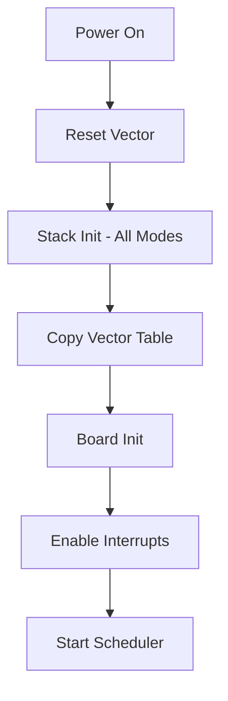
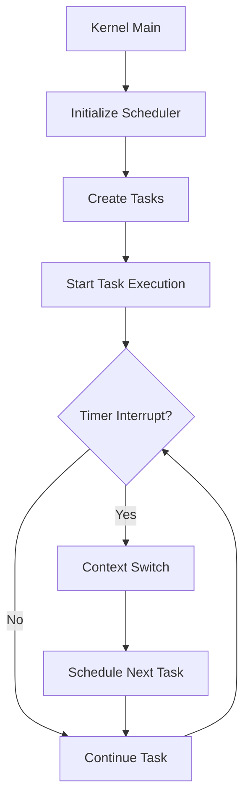
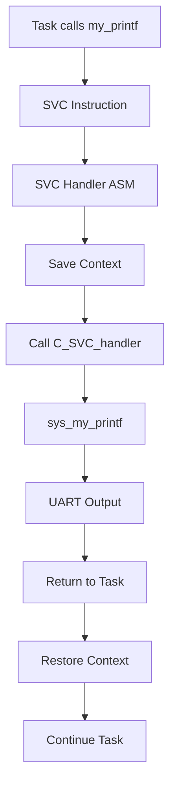

# Arquitectura del Sistema

## Visión General

El Mini-Kernel ARMv7-A está diseñado específicamente para la arquitectura ARM Cortex-A8, implementando un sistema operativo bare-metal que demuestra los principios fundamentales de programación de sistemas a bajo nivel.

## Arquitectura del Procesador

### ARM Cortex-A8 (ARMv7-A)

- **Arquitectura**: ARMv7-A de 32 bits
- **Pipeline**: In-order, superescalar
- **ISA**: ARM (32-bit) y Thumb-2 (16/32-bit)
- **Cache**: L1 separada (I-Cache/D-Cache), L2 unificada
- **MMU**: Virtual Memory System Architecture (VMSA)
- **Floating Point**: VFPv3 y NEON SIMD

### Modos del Procesador

El kernel utiliza los diferentes modos de privilegio de ARM:

| Modo | Descripción | Stack Size | Uso en el Kernel |
|------|-------------|------------|------------------|
| **User** | Modo no privilegiado | N/A | Tareas de usuario (futuro) |
| **System** | Modo privilegiado | 4KB | Sistema principal |
| **Supervisor (SVC)** | Modo de llamadas al sistema | 512B | Manejo de syscalls |
| **IRQ** | Modo de interrupciones | 512B | Manejo de IRQs |
| **FIQ** | Modo de interrupciones rápidas | 512B | Interrupciones críticas |
| **Abort** | Modo de errores de memoria | 512B | Manejo de fallos |
| **Undefined** | Modo de instrucciones inválidas | 512B | Manejo de excepciones |

## Componentes Principales

### 1. Bootloader y Startup

```
startup.s
├── Vector Table Setup
├── Stack Initialization (todos los modos)
├── Board Initialization
└── Jump to Kernel Main
```

**Características**:
- Configuración de tabla de vectores en 0x00000000
- Inicialización de pilas para cada modo del procesador
- Habilitación de interrupciones después de init

### 2. Exception Handlers

```
handlers.s
├── Reset Vector
├── Undefined Instruction
├── Software Interrupt (SVC)
├── Prefetch Abort
├── Data Abort
├── IRQ Handler
└── FIQ Handler
```

**Flujo de Manejo de Excepciones**:
1. Hardware guarda contexto básico
2. Handler ASM preserva registros adicionales
3. Llama a handler C específico
4. Restaura contexto completo
5. Retorna al código original

### 3. Memory Layout

El kernel utiliza un mapa de memoria específico definido en `memmap.ld`:

```
0x70010000 ┌─────────────────┐
           │  Kernel Code    │ .text
           │  (.reset_vector)│
           │  (.start)       │
           │  (.kernel_text) │
           ├─────────────────┤
           │  Task Code      │ .task_text
           │  (.tarea1_text) │
           │  (.tarea2_text) │
           │  (.tarea3_text) │
           ├─────────────────┤
           │  Data Section   │ .data
           │  (.tcb_data)    │
           ├─────────────────┤
           │  BSS Section    │ .bss
           └─────────────────┘
0x70020000 ┌─────────────────┐
           │  Stack Space    │ 1MB total
           │  (All modes)    │
           └─────────────────┘
```

### 4. Task Architecture

El sistema implementa un modelo de tareas cooperativo:

```c
typedef struct {
    uint32_t stack_pointer;    // Stack pointer de la tarea
    uint32_t state;           // Estado de la tarea
    uint32_t priority;        // Prioridad (futuro uso)
    uint32_t id;             // ID único de tarea
} tcb_t;
```

**Tareas Implementadas**:
- **Tarea Idle**: Ejecuta `WFI` para ahorro de energía
- **Tarea 1**: Cálculos de Fibonacci
- **Tarea 2**: Conjetura de Collatz  
- **Tarea 3**: Factorización de números primos

## Board Support Package (BSP)

### Hardware Abstracción

El BSP abstrae el hardware específico del RealView PB-A8:

```c
board_init()
├── UART Initialization
├── Timer Setup  
├── Interrupt Controller Setup
└── Other Peripheral Init
```

### Periféricos Soportados

- **UART PL011**: Comunicación serie para debug/output
- **Timer SP804**: Generación de ticks del sistema
- **GIC PL390**: Generic Interrupt Controller
- **Memory Controller**: Configuración básica de RAM

## Flujo de Ejecución

### 1. Boot Sequence



### 2. Runtime Flow



### 3. System Call Flow



## Consideraciones de Diseño

### 1. Simplicidad Educativa
- Código claro y bien comentado
- Separación clara entre ASM y C
- Uso de convenciones estándar ARM AAPCS

### 2. Escalabilidad
- Arquitectura modular
- Fácil adición de nuevas tareas
- HAL permite portar a otro hardware

### 3. Debugging Support
- Símbolos de debug en ELF
- Soporte completo para GDB
- Listados de assembler para análisis

### 4. Performance
- Minimal overhead en context switch
- Uso eficiente de modos ARM
- Scheduler cooperativo simple

## Próximas Mejoras

- [ ] Implementar preemptive scheduler
- [ ] Agregar soporte para MMU
- [ ] Implementar virtual memory
- [ ] Agregar más drivers de dispositivos
- [ ] Soporte para multi-core (Cortex-A9)

## Referencias

- [ARM Architecture Reference Manual ARMv7-A](https://developer.arm.com/documentation/ddi0406/latest/)
- [ARM Cortex-A8 Technical Reference Manual](https://developer.arm.com/documentation/ddi0344/)
- [ARM AAPCS - Procedure Call Standard](https://developer.arm.com/documentation/ihi0042/)
- [QEMU RealView Platform Baseboard Documentation](https://qemu.readthedocs.io/)