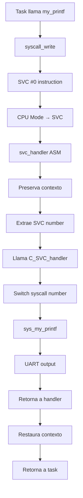

# Servicios del Kernel

## Visión General

El Mini-Kernel ARMv7-A proporciona servicios fundamentales que incluyen manejo de llamadas al sistema (syscalls), planificación de tareas (scheduler), y gestión de interrupciones. Estos servicios forman el núcleo del sistema operativo.

## System Calls (Syscalls)

### Arquitectura de Syscalls

Las llamadas al sistema se implementan usando la instrucción `SVC` (SuperVisor Call) de ARM:

```c
// Interfaz usuario para syscalls
int my_printf(const char *format, ...);

// Implementación interna
static inline int syscall_write(const char *buf) {
    int ret;
    __asm__ volatile (
        "mov r0, %1\n\t"      // Argumento en r0
        "mov r7, %2\n\t"      // Número de syscall en r7
        "svc #0\n\t"          // Llamada al sistema
        "mov %0, r0"          // Resultado en ret
        : "=r" (ret)
        : "r" (buf), "I" (SYS_WRITE)
        : "r0", "r7"
    );
    return ret;
}
```

### Flujo de Ejecución de Syscalls



### Handler de SVC en Assembly

```assembly
svc_handler:
    ; Preservar contexto
    STMFD SP!, {R0-R3, R12, LR}
    
    ; Obtener número de SVC
    LDR R1, [LR, #-4]        ; Instrucción SVC
    BIC R1, R1, #0xFF000000  ; Extraer número
    
    ; Llamar a handler en C
    MOV R0, R1               ; Número de SVC
    MOV R1, SP               ; Stack pointer
    BL C_SVC_handler
    
    ; Restaurar contexto
    LDMFD SP!, {R0-R3, R12, PC}^
```

### Handler de SVC en C

```c
uint32_t *C_SVC_handler(uint32_t svc_num, uint32_t *sp_irq) {
    uint32_t arg0;
    
    if (sp_irq != NULL) {
        arg0 = sp_irq[2]; // r0 desde el stack
        
        switch (svc_num) {
            case SYS_WRITE:
                sp_irq[2] = sys_my_printf((const char *)arg0);
                break;
            default:
                // Syscall no implementada
                sp_irq[2] = -1;
                break;
        }
    }
    
    return sp_irq;
}
```

### Syscalls Implementadas

| Número | Nombre | Descripción | Parámetros | Retorno |
|--------|--------|-------------|------------|---------|
| 0x01 | SYS_WRITE | Escritura a UART | `const char* buffer` | `int bytes_written` |

### Implementación de sys_my_printf

```c
int sys_my_printf(const char *buf) {
    int i = -1;
    _uart_t *UART0 = (_uart_t *)UART0_ADDR;
    
    if (buf != NULL) {
        i = 0;
        while (buf[i] != '\0') {
            uart_putc(UART0, (unsigned int)(buf[i]));
            i++;
        }
    }
    
    return i;
}
```

## Scheduler (Planificador de Tareas)

### Arquitectura del Scheduler

El kernel implementa un scheduler **cooperativo** simple:

- **No preemptivo**: Las tareas deben ceder el control voluntariamente
- **Round-robin básico**: Rotación circular entre tareas activas
- **Basado en ticks**: Usa interrupciones de timer para scheduling

### Estructura de Tareas

```c
typedef enum {
    TASK_STATE_READY,
    TASK_STATE_RUNNING, 
    TASK_STATE_BLOCKED,
    TASK_STATE_TERMINATED
} task_state_t;

typedef struct {
    uint32_t *stack_pointer;    // SP actual de la tarea
    task_state_t state;         // Estado actual
    uint32_t task_id;          // ID única
    uint32_t priority;         // Prioridad (futuro)
    char name[16];             // Nombre de la tarea
} task_control_block_t;
```

### Tabla de Tareas

```c
// Tabla global de tareas
task_control_block_t task_table[MAX_TASKS];
uint32_t current_task = 0;
uint32_t num_tasks = 0;

// Tareas del sistema
extern void tarea_idle(void);
extern void tarea1(void);      // Fibonacci
extern void tarea2(void);      // Collatz
extern void tarea3(void);      // Factorización
```

### Inicialización del Scheduler

```c
void scheduler_init(void) {
    // Inicializar tabla de tareas
    memset(task_table, 0, sizeof(task_table));
    
    // Crear tarea idle (siempre presente)
    create_task(tarea_idle, "idle", 0);
    
    // Crear tareas de usuario
    create_task(tarea1, "fibonacci", 1);
    create_task(tarea2, "collatz", 1);  
    create_task(tarea3, "factorization", 1);
    
    current_task = 0;
}
```

### Context Switch

```c
void schedule_next_task(void) {
    // Guardar contexto de tarea actual
    save_task_context(&task_table[current_task]);
    
    // Buscar próxima tarea READY
    uint32_t next_task = find_next_ready_task();
    
    if (next_task != current_task) {
        current_task = next_task;
        
        // Restaurar contexto de nueva tarea
        restore_task_context(&task_table[current_task]);
    }
}
```

### Tarea Idle

```c
__attribute__((section(".tareaidle_text"))) 
void tarea_idle(void) {
    while (1) {
        HALT_CPU;  // WFI instruction
    }
}
```

## Gestión de Interrupciones

### Vector Table

```assembly
tabla:
    LDR PC, lit_reset_vector      // Reset
    LDR PC, lit_undef_handler     // Undefined instruction
    LDR PC, lit_svc_handler       // Software interrupt (syscall)
    LDR PC, lit_pabt_handler      // Prefetch abort
    LDR PC, lit_dabt_handler      // Data abort  
    LDR PC, lit_reserved_handler  // Reserved
    LDR PC, lit_irq_handler       // IRQ
    LDR PC, lit_fiq_handler       // FIQ
```

### IRQ Handler

```assembly
irq_handler:
    ; Cambiar a modo System para preservar contexto
    SUB LR, LR, #4               ; Ajustar LR
    SRSDB SP!, #MODE_SYS         ; Guardar LR_irq y SPSR_irq
    CPS #MODE_SYS               ; Cambiar a modo System
    
    ; Preservar registros
    PUSH {R0-R3, R12}
    
    ; Llamar a handler en C
    BL C_irq_handler
    
    ; Restaurar registros  
    POP {R0-R3, R12}
    
    ; Retornar
    RFEFD SP!                   ; Restaurar PC y CPSR
```

### Handler de IRQ en C

```c
void C_irq_handler(void) {
    // Leer registro de estado del GIC
    uint32_t irq_id = gic_get_interrupt_id();
    
    switch (irq_id) {
        case TIMER_IRQ:
            timer_irq_handler();
            schedule_next_task();  // Scheduling cooperativo
            break;
            
        case UART_IRQ:
            uart_irq_handler(); 
            break;
            
        default:
            // IRQ no manejada
            break;
    }
    
    // Acknowledge interrupt en GIC
    gic_end_interrupt(irq_id);
}
```

### Timer IRQ Handler

```c
static uint32_t system_ticks = 0;

void timer_irq_handler(void) {
    system_ticks++;
    
    // Limpiar interrupt en timer
    timer_clear_interrupt(TIMER0);
    
    // Despertar tareas si es necesario
    wake_sleeping_tasks();
}
```

## Generic Interrupt Controller (GIC)

### Configuración del GIC

```c
typedef struct {
    volatile uint32_t ICDISER[32];    // Interrupt Set-Enable
    volatile uint32_t ICDICER[32];    // Interrupt Clear-Enable  
    volatile uint32_t ICDISPR[32];    // Interrupt Set-Pending
    volatile uint32_t ICDICPR[32];    // Interrupt Clear-Pending
    // ... más registros
} gic_distributor_t;

typedef struct {
    volatile uint32_t ICCICR;         // CPU Interface Control
    volatile uint32_t ICCPMR;         // Interrupt Priority Mask
    volatile uint32_t ICCIAR;         // Interrupt Acknowledge
    volatile uint32_t ICCEOIR;        // End of Interrupt
    // ... más registros  
} gic_cpu_interface_t;
```

### Inicialización del GIC

```c
void gic_init(void) {
    gic_distributor_t *dist = (gic_distributor_t *)GIC_DIST_BASE;
    gic_cpu_interface_t *cpu = (gic_cpu_interface_t *)GIC_CPU_BASE;
    
    // Habilitar distributor
    dist->ICDDCR = 1;
    
    // Configurar CPU interface
    cpu->ICCICR = 1;        // Enable CPU interface
    cpu->ICCPMR = 0xF0;     // Set priority mask
    
    // Habilitar interrupciones específicas
    gic_enable_interrupt(TIMER_IRQ);
    gic_enable_interrupt(UART_IRQ);
}
```

## Timer Support

### Timer SP804 Configuration

```c
typedef struct {
    volatile uint32_t LOAD;           // Load Register
    volatile uint32_t VALUE;          // Current Value
    volatile uint32_t CONTROL;        // Control Register
    volatile uint32_t INTCLR;         // Interrupt Clear
    volatile uint32_t MIS;            // Masked Interrupt Status
} sp804_timer_t;

void timer_init(uint32_t load_value) {
    sp804_timer_t *timer = (sp804_timer_t *)TIMER0_BASE;
    
    timer->LOAD = load_value;
    timer->CONTROL = 0xE2;  // 32-bit, periodic, interrupt enable
    timer->CONTROL |= 0x80; // Timer enable
}
```

## Debugging y Profiling

### Debug Prints

```c
#ifdef DEBUG
#define DEBUG_PRINTF(fmt, ...) my_printf("[DEBUG] " fmt, ##__VA_ARGS__)
#else  
#define DEBUG_PRINTF(fmt, ...)
#endif

void scheduler_debug_info(void) {
    DEBUG_PRINTF("Current task: %d\n", current_task);
    DEBUG_PRINTF("System ticks: %u\n", system_ticks);
    
    for (int i = 0; i < num_tasks; i++) {
        DEBUG_PRINTF("Task %d: %s, state=%d\n", 
                    i, task_table[i].name, task_table[i].state);
    }
}
```

### Performance Monitoring

```c
static uint32_t context_switches = 0;
static uint32_t irq_count = 0;

void performance_stats(void) {
    my_printf("Context switches: %u\n", context_switches);
    my_printf("IRQ count: %u\n", irq_count);  
    my_printf("Uptime ticks: %u\n", system_ticks);
}
```

## Extensiones Futuras

### 1. Preemptive Scheduling

```c
void timer_preempt_handler(void) {
    // Forzar context switch cada quantum
    if (++current_quantum >= QUANTUM_TICKS) {
        current_quantum = 0;
        schedule_next_task();
    }
}
```

### 2. Priority-based Scheduling

```c
uint32_t find_highest_priority_task(void) {
    uint32_t highest_priority = 0;
    uint32_t selected_task = 0;
    
    for (int i = 0; i < num_tasks; i++) {
        if (task_table[i].state == TASK_STATE_READY &&
            task_table[i].priority > highest_priority) {
            highest_priority = task_table[i].priority;
            selected_task = i;
        }
    }
    
    return selected_task;
}
```

### 3. Inter-task Communication

```c
typedef struct {
    uint32_t sender_id;
    uint32_t receiver_id;
    uint8_t data[MESSAGE_SIZE];
    uint32_t length;
} message_t;

int send_message(uint32_t dest_task, const void *data, uint32_t length);
int receive_message(message_t *msg);
```

## Referencias

- [ARM Exception Handling](https://developer.arm.com/documentation/dui0471/latest/)
- [ARM Generic Interrupt Controller](https://developer.arm.com/documentation/ddi0416/)
- [Operating Systems: Design and Implementation](https://www.minix3.org/)