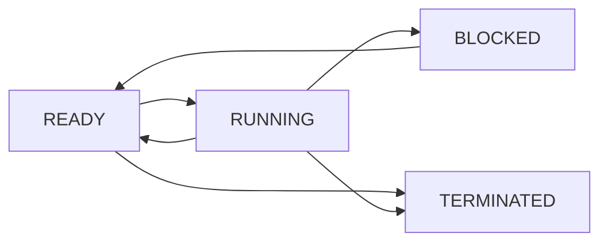
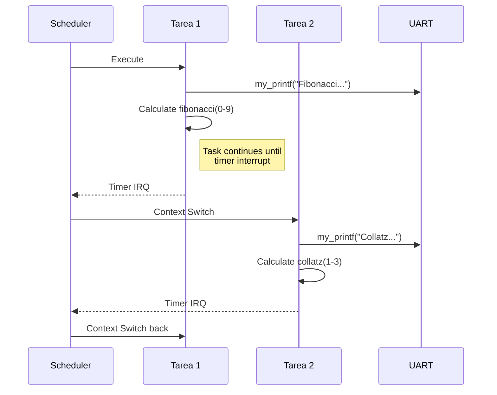

# Gestión de Tareas

## Visión General

El sistema de gestión de tareas del Mini-Kernel implementa un modelo cooperativo simple donde las tareas se ejecutan hasta completar su quantum de tiempo o hasta que voluntariamente ceden el control. El sistema actual soporta hasta 4 tareas concurrentes.

## Modelo de Tareas

### Características del Sistema

- **Cooperativo**: Las tareas deben ceder control voluntariamente
- **Multitarea**: Múltiples tareas pueden estar activas
- **Determinístico**: Comportamiento predecible para sistemas embebidos
- **Estático**: Tareas definidas en tiempo de compilación

### Estados de Tareas



```c
typedef enum {
    TASK_STATE_READY,       // Lista para ejecutar
    TASK_STATE_RUNNING,     // Ejecutándose actualmente  
    TASK_STATE_BLOCKED,     // Esperando algún evento
    TASK_STATE_TERMINATED   // Terminada
} task_state_t;
```

## Tareas Implementadas

### 1. Tarea Idle

**Propósito**: Tarea por defecto cuando no hay otras tareas activas.

```c
__attribute__((section(".tareaidle_text"))) 
void tarea_idle(void) {
    while (1) {
        HALT_CPU;  // WFI - Wait For Interrupt
    }
}
```

**Características**:
- Siempre en estado READY
- Menor prioridad
- Conserva energía con WFI
- No puede ser terminada

### 2. Tarea 1 - Fibonacci

**Propósito**: Demuestra cálculos matemáticos y uso de syscalls.

```c
__attribute__((section(".tarea1_text"))) 
void tarea1(void) {
    uint32_t i = 0;
    while (1) {
        my_printf("Prueba de funciones:\n");
        my_printf("Cálculo del número de Fibonacci:\n");
        
        for (i = 0; i < 10; i++) {
            printf("Fibonacci(%u) = %u\n", i, fibonacci(i));
        }
    }
}
```

**Funciones utilizadas**:
```c
uint32_t fibonacci(uint32_t n) {
    if (n <= 1) return n;
    return fibonacci(n-1) + fibonacci(n-2);
}
```

### 3. Tarea 2 - Conjetura de Collatz

**Propósito**: Implementa el algoritmo de Collatz para demostrar loops complejos.

```c
__attribute__((section(".tarea2_text"))) 
void tarea2(void) {
    uint32_t i = 0, num = 0;
    while (1) {
        my_printf("Conjetura de Collatz:\n");
        
        for (i = 1; i < 4; i++) {
            num = i;
            printf("Conjetura de Collatz(%u): ", i);
            
            while (num != 1) {
                printf("%u ", num);
                num = conjetura_collatz(num);
            }
            my_printf("1\n");
        }
    }
}
```

**Algoritmo de Collatz**:
```c
uint32_t conjetura_collatz(uint32_t n) {
    if (n % 2 == 0) {
        return n / 2;
    } else {
        return 3 * n + 1;  
    }
}
```

### 4. Tarea 3 - Factorización Prima

**Propósito**: Demuestra algoritmos de factorización y uso de arrays.

```c
__attribute__((section(".tarea3_text"))) 
void tarea3(void) {
    uint32_t i = 0, num = 0;
    unsigned int factores[20];
    
    while (1) {
        my_printf("Factorización de números primos:\n");
        num = 28;
        printf("Factores primos de %u: ", num);
        
        factorizacion_primos(num, factores);
        
        for (i = 0; factores[i] != 0; i++) {
            printf("%u ", factores[i]);
        }
        my_printf("\nFactorización completa.\n");
    }
}
```

**Algoritmo de factorización**:
```c
void factorizacion_primos(uint32_t n, uint32_t factores[]) {
    uint32_t i = 0, divisor = 2;
    
    while (n > 1) {
        if (n % divisor == 0) {
            factores[i++] = divisor;
            n /= divisor;
        } else {
            divisor++;
        }
    }
    factores[i] = 0; // Terminator
}
```

## Task Control Block (TCB)

### Estructura Conceptual

Aunque el sistema actual no implementa TCBs completos, la estructura sería:

```c
typedef struct {
    // Context info
    uint32_t *stack_pointer;    // SP actual de la tarea
    uint32_t *stack_base;       // Base del stack
    uint32_t stack_size;        // Tamaño del stack
    
    // Task info  
    uint32_t task_id;          // ID única
    char name[16];             // Nombre de la tarea
    task_state_t state;        // Estado actual
    uint32_t priority;         // Prioridad
    
    // Statistics
    uint32_t cpu_time;         // Tiempo de CPU usado
    uint32_t switches;         // Número de context switches
    uint32_t last_run;         // Último tick que se ejecutó
} task_control_block_t;
```

### Variables Globales de Tareas

```c
// Variables globales para cada tarea  
__attribute__((section(".tcb_data"))) uint32_t global_tarea1 = 0;
__attribute__((section(".tcb_data"))) uint32_t global_tarea2 = 0;
// global_tarea3 podría agregarse según necesidad
```

## Context Switching

### Contexto de ARM

El contexto de una tarea incluye:

```
┌─────────────────┐
│ General Purpose │ R0-R12
│ Registers       │
├─────────────────┤
│ Stack Pointer   │ SP (R13)
├─────────────────┤  
│ Link Register   │ LR (R14)
├─────────────────┤
│ Program Counter │ PC (R15)
├─────────────────┤
│ Status Register │ CPSR/SPSR
└─────────────────┘
```

### Context Save/Restore (Conceptual)

```assembly
; Guardar contexto
save_context:
    STMFD SP!, {R0-R12, LR}    ; Guardar registros
    MRS R0, CPSR               ; Obtener CPSR
    STMFD SP!, {R0}            ; Guardar CPSR
    
    ; Guardar SP en TCB
    LDR R1, =current_task_tcb
    STR SP, [R1]               ; Guardar SP
    BX LR

; Restaurar contexto  
restore_context:
    LDR R1, =current_task_tcb
    LDR SP, [R1]               ; Restaurar SP
    
    LDMFD SP!, {R0}            ; Restaurar CPSR
    MSR CPSR, R0
    LDMFD SP!, {R0-R12, PC}    ; Restaurar registros y PC
```

## Scheduler Implementation

### Round-Robin Simple

```c
static uint32_t current_task = 0;
static uint32_t num_active_tasks = 4;

void schedule_next_task(void) {
    uint32_t next_task;
    
    // Buscar próxima tarea activa
    for (int i = 1; i <= num_active_tasks; i++) {
        next_task = (current_task + i) % num_active_tasks;
        
        if (task_is_ready(next_task)) {
            current_task = next_task;
            break;
        }
    }
    
    // Ejecutar tarea seleccionada
    execute_task(current_task);
}
```

### Task Execution Flow



## Task Creation (Conceptual)

### Stack Setup for New Task

```c
uint32_t* create_task_stack(void *task_entry, uint32_t *stack_base, uint32_t stack_size) {
    uint32_t *sp = stack_base + stack_size - 1;
    
    // Setup initial stack frame
    *--sp = 0x01000000;        // Initial CPSR (Thumb bit set)
    *--sp = (uint32_t)task_entry; // PC - task entry point
    *--sp = 0;                 // LR
    *--sp = 0;                 // R12
    *--sp = 0;                 // R3
    *--sp = 0;                 // R2  
    *--sp = 0;                 // R1
    *--sp = 0;                 // R0
    
    return sp;
}
```

### Task Registration

```c
typedef struct {
    void (*entry_point)(void);
    char name[16];
    uint32_t stack_size;
    uint32_t priority;
} task_config_t;

const task_config_t task_configs[] = {
    { tarea_idle, "idle", 512, 0 },
    { tarea1, "fibonacci", 512, 1 },
    { tarea2, "collatz", 512, 1 },
    { tarea3, "primes", 512, 1 }
};
```

## Task Communication

### Shared Memory (Current Implementation)

Las tareas actualmente comparten memoria global:

```c
// Shared variables in .tcb_data section
extern uint32_t global_tarea1;
extern uint32_t global_tarea2;

// Ejemplo de uso
void tarea1(void) {
    global_tarea1++;  // Modifica variable compartida
    // ...
}

void tarea2(void) {
    if (global_tarea1 > 10) {
        // React to tarea1's state
    }
    // ...
}
```

### Future: Message Passing

```c
typedef struct {
    uint32_t sender;
    uint32_t receiver;  
    uint32_t message_type;
    uint8_t data[32];
    uint32_t length;
} message_t;

// Message queue per task
message_t task_messages[MAX_TASKS][MESSAGE_QUEUE_SIZE];

int send_message(uint32_t dest_task, message_t *msg);
int receive_message(uint32_t task_id, message_t *msg);
```

## Synchronization

### Critical Sections

```c
// Disable interrupts for atomic operations
static inline void enter_critical_section(void) {
    __asm__ volatile ("CPSID if");
}

static inline void exit_critical_section(void) {
    __asm__ volatile ("CPSIE if");  
}

// Example usage
void atomic_increment(uint32_t *value) {
    enter_critical_section();
    (*value)++;
    exit_critical_section();
}
```

### Future: Semaphores

```c
typedef struct {
    int count;
    uint32_t waiting_tasks[MAX_TASKS];
    int wait_count;
} semaphore_t;

void semaphore_wait(semaphore_t *sem);
void semaphore_signal(semaphore_t *sem);
```

## Performance Monitoring

### Task Statistics

```c
typedef struct {
    uint32_t execution_count;   // Veces ejecutada
    uint32_t total_runtime;     // Tiempo total de ejecución
    uint32_t avg_runtime;       // Tiempo promedio
    uint32_t max_runtime;       // Tiempo máximo
} task_stats_t;

task_stats_t task_statistics[MAX_TASKS];
```

### Profiling Support

```c
void task_profile_start(uint32_t task_id) {
    task_statistics[task_id].start_time = get_system_ticks();
}

void task_profile_end(uint32_t task_id) {
    uint32_t runtime = get_system_ticks() - task_statistics[task_id].start_time;
    task_statistics[task_id].total_runtime += runtime;
    task_statistics[task_id].execution_count++;
    
    if (runtime > task_statistics[task_id].max_runtime) {
        task_statistics[task_id].max_runtime = runtime;
    }
}
```

## Debugging Tasks

### Task State Monitoring

```c
void print_task_info(void) {
    my_printf("=== Task Information ===\n");
    my_printf("Current task: %u\n", current_task);
    
    for (int i = 0; i < MAX_TASKS; i++) {
        if (task_configs[i].entry_point) {
            my_printf("Task %d: %s\n", i, task_configs[i].name);
            my_printf("  State: %d\n", get_task_state(i));
            my_printf("  Priority: %u\n", task_configs[i].priority);
        }
    }
}
```

### Stack Usage Analysis

```c
void check_stack_usage(uint32_t task_id) {
    // Simple stack canary check
    uint32_t *stack_base = get_task_stack_base(task_id);
    uint32_t *stack_top = get_task_stack_top(task_id);
    uint32_t *current_sp = get_task_sp(task_id);
    
    uint32_t used = stack_top - current_sp;
    uint32_t total = stack_top - stack_base;
    uint32_t usage_percent = (used * 100) / total;
    
    my_printf("Task %u stack usage: %u%% (%u/%u bytes)\n", 
              task_id, usage_percent, used * 4, total * 4);
}
```

## Extensiones Futuras

### 1. Preemptive Multitasking

```c
void timer_tick_handler(void) {
    current_time_slice--;
    
    if (current_time_slice <= 0) {
        // Force context switch
        save_current_task_context();
        schedule_next_task();
        restore_new_task_context();
    }
}
```

### 2. Priority-based Scheduling

```c
uint32_t find_highest_priority_ready_task(void) {
    uint32_t highest_priority = 0;
    uint32_t selected_task = 0;
    
    for (int i = 0; i < MAX_TASKS; i++) {
        if (task_table[i].state == TASK_STATE_READY && 
            task_table[i].priority > highest_priority) {
            highest_priority = task_table[i].priority;
            selected_task = i;
        }
    }
    
    return selected_task;
}
```

### 3. Dynamic Task Creation

```c
int create_dynamic_task(void (*entry)(void), const char *name, 
                       uint32_t stack_size, uint32_t priority) {
    // Find free TCB slot
    int task_id = find_free_task_slot();
    if (task_id < 0) return -1;
    
    // Allocate stack
    void *stack = kmalloc(stack_size);
    if (!stack) return -1;
    
    // Initialize TCB
    init_task_tcb(task_id, entry, name, stack, stack_size, priority);
    
    return task_id;
}
```

## Referencias

- [ARM Cortex-A Series Programmer's Guide](https://developer.arm.com/documentation/den0013/latest/)
- [Real-Time Systems Design and Analysis](https://www.wiley.com/en-us/Real+Time+Systems%3A+Design+Principles+for+Distributed+Embedded+Applications%2C+2nd+Edition-p-9780470768648)
- [Operating Systems: Three Easy Pieces](https://pages.cs.wisc.edu/~remzi/OSTEP/)